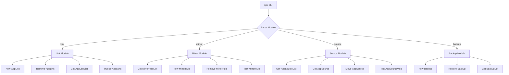
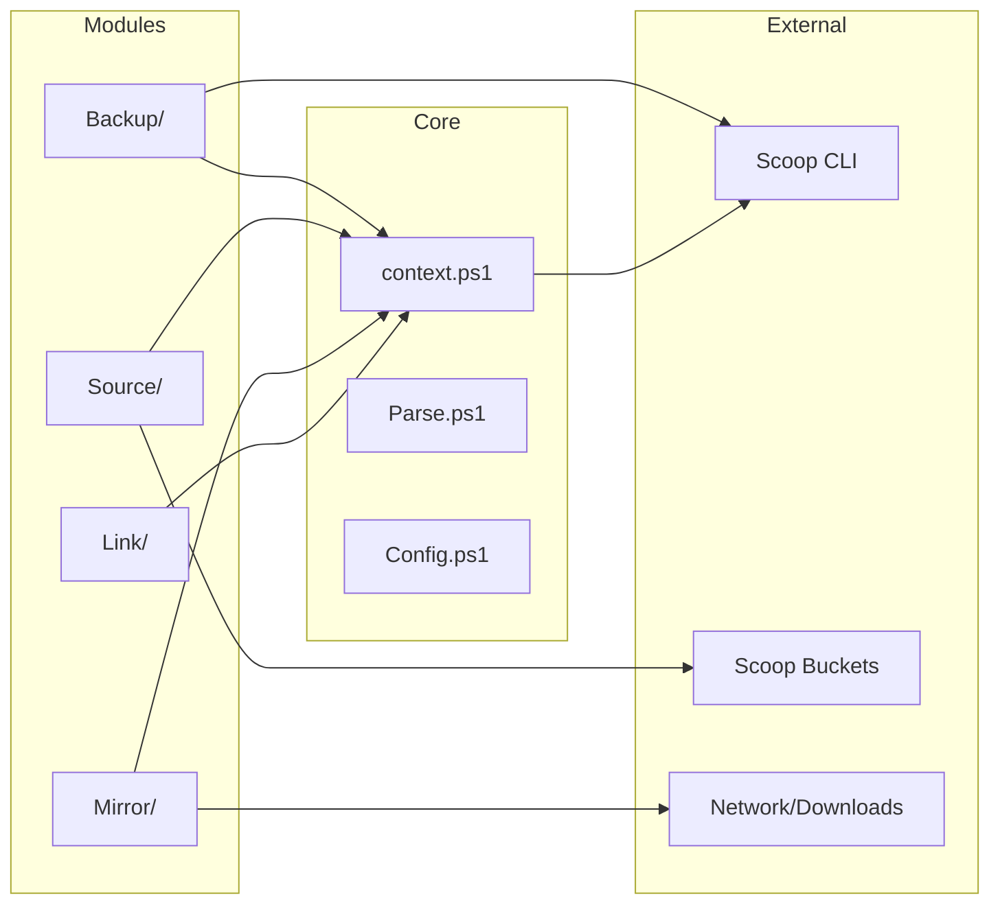

# SPX - Scoop Power Extensions

## Project Overview

**SPX** (Scoop Power Extensions) is a PowerShell-based enhancement toolkit for Scoop that provides orthogonal functionalities not covered by Scoop's core features. The name is terse, pronounceable, and suggests "extensions" while being distinct from Scoop's own commands.

### Design Philosophy

1. **Orthogonality**: SPX features complement Scoop without duplicating functionality
2. **Modularity**: Each feature is an independent module with clear boundaries
3. **Safety First**: Destructive operations require confirmation; all operations are reversible where possible
4. **Transparency**: Clear logging and status reporting for all operations
5. **Stateless by Default**: Modules should not record state unless absolutely necessary

---

## Architecture

```
spx/
├── spx.ps1              # CLI entry point
├── context.ps1          # Scoop context resolution
├── lib/
│   ├── Core.ps1         # Shared utilities
│   ├── Parse.ps1        # Argument parsing
│   └── Config.ps1       # Configuration management
├── modules/
│   ├── Link/            # Custom path management
│   │   ├── Link.ps1
│   │   └── Move.ps1
│   ├── Mirror/          # Download source management
│   │   └── Mirror.ps1
│   ├── Source/          # Installed app source management
│   │   └── Source.ps1
│   └── Backup/          # Configuration backup/restore
│       └── Backup.ps1
└── exec/
    ├── Link.ps1
    ├── Mirror.ps1
    ├── Source.ps1
    └── Backup.ps1
```

---

## Configuration Location

SPX follows Scoop's configuration convention:

| Config Type | Location |
|-------------|----------|
| SPX Config | `$env:SCOOP\spx\` or `~/scoop/spx/` |
| Global Config | `$env:SCOOP_GLOBAL\spx\` or `~/scoop/apps/spx/` |
| Links Registry | `$env:SCOOP\spx\links.json` |
| Mirror Rules | `$env:SCOOP\spx\mirrors.json` |
| Backups | `$env:SCOOP\spx\backups\` |

```
~/scoop/
├── apps/
├── buckets/
├── persist/
├── shims/
├── config.json          # Scoop's config
└── spx/                 # SPX configuration directory
    ├── config.json      # SPX global config
    ├── links.json       # Linked apps registry
    ├── mirrors.json     # Mirror rules
    └── backups/         # Backup archives
```

---

## Function Naming Convention

SPX follows canonical Microsoft PowerShell naming conventions (Verb-Noun):

### Approved Verbs

| Verb | Purpose | Example |
|------|---------|---------|
| `Get-` | Retrieve data | `Get-ScoopContext` |
| `Set-` | Modify configuration | `Set-MirrorRule` |
| `New-` | Create new resource | `New-AppLink` |
| `Remove-` | Delete resource | `Remove-AppLink` |
| `Test-` | Validate/Check | `Test-AppInstalled` |
| `Invoke-` | Execute operation | `Invoke-AppSync` |
| `Export-` | Export data | `Export-Backup` |
| `Import-` | Import data | `Import-Backup` |
| `Register-` | Register handler | `Register-MirrorHook` |
| `Unregister-` | Remove handler | `Unregister-MirrorHook` |

### Maybe Pattern

For functions that may return `$null` instead of throwing:

```powershell
# Returns object or $null
function Get-AppLink {
    param([string]$AppName)
    # Returns link info or $null if not linked
}

# Boolean test
function Test-AppLinked {
    param([string]$AppName)
    # Returns $true or $false
}
```

---

## Module Specifications

### 1. LINK - Custom Path Management

**Purpose**: Relocate installed packages to custom paths via symbolic links.

**Commands**:
```
spx link <app> --path <path>    Move app to custom path
spx link <app> --to <path>      Move app to custom path (alias)
spx unlink <app>                Restore app to Scoop directory
spx linked                      List all linked apps
spx sync [<app>]                Sync linked app states
```

**Public Functions**:
```powershell
function New-AppLink {
    param(
        [Parameter(Mandatory)]
        [string]$AppName,
        
        [Parameter(Mandatory)]
        [string]$Path,
        
        [switch]$Global
    )
}

function Remove-AppLink {
    param(
        [Parameter(Mandatory)]
        [string]$AppName,
        
        [switch]$Global
    )
}

function Get-AppLink {
    param(
        [string]$AppName,
        
        [switch]$Global
    )
    # Returns link info or $null
}

function Get-AppLinkList {
    param([switch]$Global)
    # Returns all linked apps
}

function Invoke-AppSync {
    param(
        [string]$AppName,
        
        [switch]$Global
    )
}

function Test-AppLinked {
    param(
        [Parameter(Mandatory)]
        [string]$AppName,
        
        [switch]$Global
    )
}
```

**Implementation Notes**:
- `--path` or `--to` flag is explicit and self-documenting
- Fix critical bug in `Move-Package` - use correct variable names
- Support both global and local apps

---

### 2. MIRROR - Download Source Management

**Purpose**: Configure alternative download mirrors for packages, useful for:
- GitHub mirror sites (faster downloads in restricted regions)
- Custom internal mirrors for enterprise use
- Fallback sources when primary is unavailable

**Commands**:
```
spx mirror list                          List configured mirrors
spx mirror add <pattern> <url>           Add mirror rule
spx mirror remove <pattern>              Remove mirror rule
spx mirror enable                        Enable mirror system
spx mirror disable                       Disable mirror system
spx mirror test [<pattern>]              Test mirror connectivity
spx mirror status                        Show current mirror status
```

**Public Functions**:
```powershell
function Get-MirrorRule {
    param([string]$Pattern)
    # Returns rule or $null
}

function Get-MirrorRuleList {
    param()
    # Returns all mirror rules
}

function New-MirrorRule {
    param(
        [Parameter(Mandatory)]
        [string]$Pattern,
        
        [Parameter(Mandatory)]
        [string]$Url,
        
        [int]$Priority = 100,
        
        [switch]$Enabled
    )
}

function Remove-MirrorRule {
    param(
        [Parameter(Mandatory)]
        [string]$Pattern
    )
}

function Set-MirrorEnabled {
    param(
        [Parameter(Mandatory)]
        [bool]$Enabled
    )
}

function Test-MirrorRule {
    param(
        [string]$Pattern,
        
        [string]$TestUrl
    )
    # Returns connectivity test result
}

function Get-MirrorStatus {
    param()
    # Returns current mirror system status
}
```

**Pattern Matching**:
- `github.com/*` - Match all GitHub URLs
- `github.com/user/repo/*` - Match specific repository
- `*` - Match all URLs (fallback)

**Data Structure** (`mirrors.json`):
```json
{
  "enabled": true,
  "rules": [
    {
      "pattern": "github.com/*",
      "url": "https://mirror.ghproxy.com/",
      "enabled": true,
      "priority": 1
    },
    {
      "pattern": "raw.githubusercontent.com/*",
      "url": "https://mirror.ghproxy.com/raw/",
      "enabled": true,
      "priority": 2
    }
  ],
  "fallback": true
}
```

**Implementation**:
- Intercepts Scoop's download URLs via hook or wrapper
- Supports regex patterns for flexible matching
- Maintains original URL for fallback
- Logs all mirror redirections

---

### 3. SOURCE - Installed App Source Management

**Purpose**: Change or manage the bucket/source of installed applications.

**Design Principle**: This module is **stateless**. It does not record any state. Operations only work if the target bucket contains the package.

**Commands**:
```
spx source list                          List all apps with their sources
spx source show <app>                    Show detailed source info for app
spx source change <app> <bucket>         Change app to different bucket
spx source verify [<app>]                Verify app manifest matches bucket
spx source diff <app> <bucket>           Compare installed vs bucket manifest
```

**Public Functions**:
```powershell
function Get-AppSource {
    param(
        [Parameter(Mandatory)]
        [string]$AppName
    )
    # Returns current bucket/source info from Scoop
}

function Get-AppSourceList {
    param()
    # Lists all apps with their sources (reads from Scoop directly)
}

function Move-AppSource {
    param(
        [Parameter(Mandatory)]
        [string]$AppName,
        
        [Parameter(Mandatory)]
        [string]$Bucket,
        
        [switch]$Force
    )
    # Changes app to different bucket
    # Fails if bucket doesn't have the package
    # No state recorded
}

function Test-AppInBucket {
    param(
        [Parameter(Mandatory)]
        [string]$AppName,
        
        [Parameter(Mandatory)]
        [string]$Bucket
    )
    # Returns $true if package exists in bucket
}

function Compare-AppManifest {
    param(
        [Parameter(Mandatory)]
        [string]$AppName,
        
        [Parameter(Mandatory)]
        [string]$Bucket
    )
    # Compares installed manifest with bucket manifest
    # Returns difference object
}

function Test-AppSourceValid {
    param(
        [Parameter(Mandatory)]
        [string]$AppName
    )
    # Verifies app manifest matches current bucket
}
```

**Use Cases**:
- Move app from one bucket to another (e.g., `extras` to `main`)
- Switch between stable and development versions
- Fix broken bucket references
- Verify app integrity against source

**No Data Storage**: This module reads directly from Scoop's installed apps and bucket manifests. No `sources.json` is maintained.

---

### 4. BACKUP - Configuration Backup & Restore

**Purpose**: Export and import Scoop configuration for migration or disaster recovery.

**Commands**:
```
spx backup create [path]                 Create backup archive
spx backup restore <archive>             Restore from backup
spx backup list                          List available backups
spx backup status                        Show backup status
```

**Public Functions**:
```powershell
function New-Backup {
    param(
        [string]$Path,
        
        [switch]$IncludePersist,
        
        [switch]$IncludeCache
    )
    # Creates backup archive
}

function Restore-Backup {
    param(
        [Parameter(Mandatory)]
        [string]$Archive,
        
        [switch]$Force
    )
    # Restores from backup
}

function Get-BackupList {
    param()
    # Lists available backups
}

function Get-BackupStatus {
    param()
    # Shows backup status
}
```

**Backup Contents**:
- Installed app list with versions
- Bucket configurations
- SPX configurations (links, mirrors)
- Scoop config.json
- Persist data (optional)

**Data Structure** (backup archive):
```json
{
  "version": "1.0.0",
  "created": "2024-01-15T10:00:00",
  "scoop": {
    "apps": ["7zip@23.01", "git@2.43.0"],
    "buckets": {
      "main": "https://github.com/ScoopInstaller/Main",
      "extras": "https://github.com/ScoopInstaller/Extras"
    },
    "config": { }
  },
  "spx": {
    "links": { },
    "mirrors": { }
  }
}
```

---

## CLI Design

### Command Structure

```
spx <module> <action> [<args>] [options]
```

### Global Options

```
-h, --help       Show help
-v, --verbose    Enable verbose output
-d, --debug      Enable debug output
--global         Operate on global apps
--yes            Skip confirmation prompts
```

### Help System

```
spx                          Show main help
spx <module>                 Show module help
spx <module> <action> -h     Show action help
```

---

## Error Handling Strategy

### Error Categories

| Category | Behavior | Example |
|----------|----------|---------|
| Context | Terminate immediately | Scoop not installed |
| Validation | Return error, no action | Invalid path provided |
| Maybe | Return `$null` | App not found |
| Recoverable | Try/catch with rollback | Move operation fails |

### Error Writing

```powershell
# Use Write-Error for recoverable errors
Write-Error "App '$AppName' is not installed."

# Use Write-Error -ErrorAction Stop for fatal errors
Write-Error "Scoop is not installed." -ErrorAction Stop

# Use Write-Warning for non-blocking issues
Write-Warning "App '$AppName' is already linked."
```

---

## Migration from SPX (Legacy)

### Renaming Map

| Old | New |
|-----|-----|
| `scpl` | `spx` |
| `scpl move <app> -R <path>` | `spx link <app> --path <path>` |
| `scpl back <app>` | `spx unlink <app>` |
| `scpl sync <app>` | `spx sync <app>` |
| `scpl list` | `spx linked` |

### Data Migration

The `apps.json` format remains compatible. Users can:
1. Install SPX alongside legacy version
2. Run `spx migrate` to import legacy data
3. Uninstall legacy version after verification

---

## Implementation Roadmap

### Phase 1: Core Refactoring
- [ ] Fix critical bugs identified in inspection
- [ ] Restructure to modular architecture
- [ ] Implement unified CLI framework
- [ ] Rename functions to Verb-Noun convention
- [ ] Move config to Scoop directory

### Phase 2: Module Migration
- [ ] Migrate link module from legacy version
- [ ] Change `-R` flag to `--path`/`--to`
- [ ] Add `linked` and `unlink` commands
- [ ] Implement configuration management

### Phase 3: New Modules
- [ ] Implement mirror module
- [ ] Implement source module (stateless)
- [ ] Implement backup module

### Phase 4: Polish
- [ ] Add comprehensive tests
- [ ] Write documentation
- [ ] Create migration tool
- [ ] Publish to Scoop bucket

---

## Mermaid Diagrams

### Command Flow



### Module Architecture



---

## Summary

SPX transforms from a single-purpose tool into a comprehensive Scoop enhancement suite.

| Module | Core Functionality | State |
|--------|-------------------|-------|
| **link** | Relocate apps to custom paths | `links.json` |
| **mirror** | Configure download mirrors | `mirrors.json` |
| **source** | Manage app bucket sources | Stateless |
| **backup** | Export/import configurations | Backup archives |

Key design decisions:
- **Verb-Noun naming**: Follows Microsoft PowerShell conventions
- **Scoop config location**: Uses `$env:SCOOP/spx/` for consistency
- **Stateless source module**: No recorded state, validates against buckets directly
